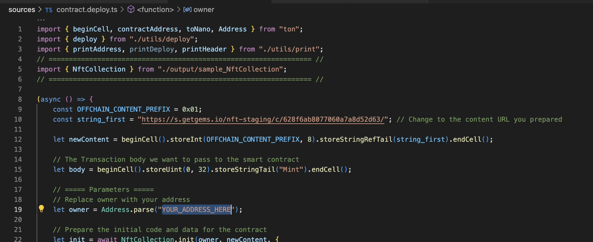

# NFT Standard in Tact


## How to use

```bash
yarn build # To build contract
yarn test # To run test cases
yarn deploy # To deploy contract
yarn read # The way to read the smart contract data after your deployed the code
```

> [!WARNING]
> Remember to change the parameter in `contract.deploy.ts` file before you run `yarn deploy`



---

 - once you run `yarn deploy` you will get the address of the deployed contract. You can use this address to interact with the contract.

## More

For more information about this GitHub repository, or if you have any questions related to Tact, feel free to visit:

-   https://t.me/ton101
-   https://t.me/tactlang

If you have more specific questions related to the Tact Language, please refer to:

-   https://tact-lang.org
-   https://tact-by-example.org
# Tact-NFT-Ton
